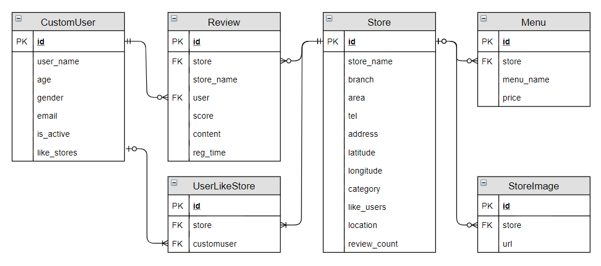

# Food Curation

이 서비스는 사용자 정보 기반 맛집 추천 서비스로 사용자에게 적절한 매장들을 추천해 주는 기능과 여러 정보를 바탕으로 각종 보고서를 제작하여 제공해 주는 기능을 가지고 있습니다.

맛집 추천 서비스의 경우 KNN과 SVDPP, K-means 알고리즘을 복합적으로 사용하여 추천해 줍니다.

보고서의 경우 다이닝 코드, 결재 데이터, 통계청 데이터 등을 활용하여 나이대별 소비 트렌드, 지역별 경제 특성분석, 상권 분석, 체인점 분석, 업종별 경향 분석 등의 결과를 보여줍니다.


## 핵심 기능 및 기대 효과

- 각종 알고리즘과 머신러닝을 기반으로 사용자에게 사용자의, 사용자를 위한, 사용자에 의한 맛집 추천 사이트
- 나만의 맛집 추천을 받고 싶은 사람들에게 맞춤 정장과 같은 느낌의 맛집 추천 시스템
- 맛집에 관한 정보 뿐만 아니라 사람들의 소비트렌드, 지역별 분석, 상권 분석, 체인점 분석, 업종별 분석 결과를 통해 경제 경향을 볼 수 있는 보고서 기능

## 주요 사용자

- 무분별한 맛집 추천에 지친 30대 차도남
- +@@

## 개발 환경

### 사용 언어

- Python 3.6.8
- nodeJS 13.5.0

### 주요 라이브러리

- npm 6.13.4
- Django 2.2.7
- djangorestframework 3.10.3
- axios 0.19.0
- vue 2.6.10
- vuex 3.1.1
- pandas 0.25.3

그 외 기타 라이브러리는 backend/requirements.txt, frontend/package.json 참조

## How to Run

이 프로젝트는 pm2를 사용하여 서버를 관리하고 nginx를 사용하여 ssl 적용 및 프록시 제어를 하고 있습니다.

nginx의 경우 아래와 같은 설정으로 80포트로 들어오면 8080포트로 넘겨주게 설정되어 있으며

```
server {
        listen 80;
        server_name i02d106.p.ssafy.io;
        location / {
                proxy_pass http://127.0.0.1:8080;
        }
}
```

인증서는 아래의 경로에 보관되어 잇습니다.

```
/etd/nginx/ssl/server.crt
/etd/nginx/ssl/server.csr
/etd/nginx/ssl/server.key
```

pm2에서는 frontend와 backend의 스크립트파일을 통해 frontend서버와 backend서버를 구동할 수 있습니다.

```
pm2 start frontend/dps.json
pm2 start backend/dps.json
```

## data schema



## 명세

### req1 데이터 DB 마이그레이션

1. DB 모델 설계

   [data schema](#data schema) 참조

2. Pandas DataFrame DB 마이그레이션

   데이터를 DB에 넣으려면 아래와 같이 실행하면 됩니다.

   ```bash
   cd backend
   python manage.py initialize
   ## 우분투 환경에선 python 대신 python3을 입력하면 된다.
   ```


### req2 웹 서비스 검색 기능 확장

1. 검색 기능 확장

   근처에 존재하는 매장들의 메뉴나 매장명을 검색하는 기능입니다. 거리를 설정할 수 있으며 현재 보고 있는 지도의 중심점에서 설정한 거리 반경 이내의 매장의 메뉴, 매장명 등을 검색할 수 있습니다.

2. 유저 정보 기능 구현

   유저의 상세 정보를 프론트에 제공해주기 위해 로그인 성공 시 유저 정보를 응답해줍니다.

   - 추가사항: 회원탈퇴, 비밀번호 변경, 비밀번호 재설정 기능

4. 음식점 정보 기능 구현

   매장명에 해당하는 매장의 정보(매장 상세정보, 메뉴, 평균평점)를 반환합니다.

4. 음식점 사진 자료 크롤링

   서비스를 진행하는동안 자동으로 이미지가 등록되지 않은 매장을 조회 시 크롤링 할 매장 아이디와 우선순위를 저장한 딕셔너리를 갱신합니다.

   크롤링 해야 할 매장의 갯수가 일정 수준 이상이 되면 자동으로 크롤링을 시작하고 크롤링 할 목록이나 크롤링 시작을 요청할 수 있는 API가 있습니다.

   크롤링 할 딕셔너리 조회 API: https://i02d106.p.ssafy.io:8765/api/crawling_check

   크롤링 시작 요청 API: https://i02d106.p.ssafy.io:8765/api/crawling_start

5. 구글에 매장명, 주소를 검색하여 받아온 결과에서 썸네일 이미지 url을 가져와 db에 저장합니다.


### req3 웹 서비스 인증 기능 구현

1. 회원가입 기능 구현

   라이브러리에서 제공하는 회원가입 기능을 커스터마이징하여 추가적인 정보를 받도록 하였습니다.

   - 추가사항: 이메일 인증

2. 로그인, 로그아웃 기능 구현

   django-rest-auth, rest_framework_jwt라이브러리를 사용하였고, 로그인 했을 경우, JWT 토큰을 프론트에 넘겨줍니다.

   JWT토큰을 사용하였기 때문에 백엔드에서는 로그아웃에 대한 처리를 따로 하지않았습니다.
   
   - 추가사항: 회원탈퇴 기능
  - 완전히 유저를 삭제하지 않고 is_active 값을 조정해줌으로써 관련 댓글과 리뷰 정보는 남겨두도록 하였습니다.
   

### req4 웹 서비스 리뷰 기능 구현

1. 리뷰 기능 구현

   리뷰 작성 요청이 들어오면 권한이 있는지 확인 후 권한이 있으면 리뷰를 작성합니다.
   
   리뷰가 작성이 되면 store와 user의 review_count를 각 각 1씩 더해 줍니다.
   
   리뷰 삭제 요청이 들어오면 권한이 있는지 확인 후 권한이 있으면 리뷰를 삭제합니다.
   
   리뷰가 삭제되면 store와 user의 review_count를 각 각 1씩 빼줍니다.

### req5 KNN 알고리즘 구현

데이터 가공 -> 알고리즘 학습 -> user_based로 id에 대한 정보 선별 -> TOP10 식당 추천

1. 데이터 가공

   리뷰가 10개 이상인 음식점의 리뷰와 리뷰가 10개 이상인 유저 두 집합에 포함되는 리뷰의 user_id, store_id, score를 가져옵니다.

2. KNN 알고리즘 학습 및 구현

   위에 전처리 한 리뷰 데이터를 기반으로 평점을 매기지 않은 음식점들 중 추정 score 값이 가장 높은 매장 상위 20개를 반환합니다.

### req6 Matrix Factorization 알고리즘 구현

1. 데이터 가공

   KNN 알고리즘 구현의 데이터 가공과 동일
   
2. SVDPP 알고리즘 학습 및 구현

   이전에 전처리한 리뷰 데이터를 기반으로 평점을 매기지 않은 음식점들 중 추정 score 값이 가장 높은 매장 상위 20개를 반환합니다.

### req7 TF-IDF 알고리즘 구현

1. 데이터 가공

   리뷰가 5개이상 작성된 매장에서 리뷰를 가져옵니다. 이 중 평점이 3점 이상일 경우 좋은 리뷰로 판단합니다.

2. TF-IDF 알고리즘 구현

   각 매장별로 좋은 리뷰를 TF, 각 매장별 전체 리뷰를 IDF로 사용하여 좋은 리뷰에서 나온 정보를 바탕으로 점수를 계산하여 높은 순으로 반환합니다. 이 정보는 각 매장 상세 페이지에서 워드클라우드로 확인할 수 있습니다.

### req8 K-Means 알고리즘 구현

1. 데이터 가공

   리뷰 작성 갯수가 10개 이상인 유저를 가져옵니다.

   성별이 남자일 경우 gender값을 15로, 여자일 경우 0으로 바꿔 줍니다.

2. K-Means 알고리즘 구현

   위에서 전처리된 데이터를 기반으로 k-means++ 알고리즘을 적용해 유저 군집 각각의 centroid를 얻어냅니다.

   각 각의 군집은 유저의 성별과 나이를 바탕으로 5개의 군집을 이루도록 만들었습니다.

### req9 컨텐츠 기반 필터링 추천 시스템 구현

매장 정보가 부족하고 가공하기에 부적절하다고 생각하여 이 부분을 유저 군집을 구하여 해당 군집의 유저(나이와 성별을 바탕으로 구분된 군집들)이 주로 찾는 매장을 추천하도록 하였습니다.

리뷰 작성 데이터가 충분하지 않은 유저의 경우 knn, kmeans알고리즘을 적용하지 않고 해당 유저가 어떤 유저 군집에 속해있는지 확인하여 매장을 추천합니다. 

### req10 하이브리드 추천 시스템 구현

저희 추천 시스템은 사용자의 정보(리뷰 작성량이 일정갯수 이상)가 충분할 경우 svdpp 혹은 knn알고리즘 바탕으로 리뷰를 작성하지 않은 음식점들의 평점을 추산하여 가장 높은 음식점을 추천 목록으로 제공합니다.

만약 사용자의 정보가 부족한 경우, 나이와 성별을 바탕으로 해당 유저가 어느 군집에 속해있는지 판별한 후 속하는 유저 군집에서 인기도점수가 높은 매장을 추천 목록으로 제공합니다.

기본적으로 svdpp와 knn알고리즘이 거의 동일한 역할을 하고 있기 때문에, 서버에 현재 어떤 알고리즘이 적용되어 있는지 확인하고 이를 변경할 수 있는 API를 만들어 원하는 알고리즘이 적용된 추천 리스트를 제공할 수 있도록 구성하였습니다.

### req11 웹서비스 구현

관리자로 등록된 유저로 로그인 한 경우 페이지 우측 상단에 관리자 페이지로 이동 링크가 보여지게 되며 클릭 시 관리자 페이지로 이동합니다.

유저, 음식점, 리뷰 등을 보거나 삭제, 음식점 등록을 할 수 있습니다.

관리자가 아닌 유저의 경우 해당 기능은 사용할 수가 없습니다.

### req12 웹서비스 배포

Food curation 서비스는 nginx와 pm2를 활용하여 aws에서 서비스 되고 있습니다.

ssl을 적용하여 프론트엔드와 백엔드 모두 https로 접근하도록 설정하였습니다.

프론트엔드와 백엔드 모두 pm2에서 관리되고 있으며 nginx에선 ssl을 위한 인증서 관리 및 프록시역할을 하고 있습니다.

### 추가사항: 경제경향보고서

파트: 개요, 지역별 경제 특성 분석, 상권 분석 및 추천, 체인점 분석, 업종별 경향 분석

- 개요
  - 조사대상 → 다이닝 코드 이용자 및 ##은행 고객
  - 조사지역 → 대한민국 전체
  - tf-idf로 분석한 최신 키워드 
  - 나이대별(2,3,4,50대) 소비 트렌드 → 은행 데이터(통계청 데이터 활용)   + 나이별 소비 증가량 → 은행 데이터
- 지역별 경제 특성 분석 → 결재 데이터 활용
  - 지역별 소비량 top3
  - 성별 top1 소비량 지역
  - 연령대별 지역 순위(소비량 top5 기준)
  - 시간대별 지역 순위(소비량 top5 기준)
- 상권 분석 및 추천 → 결재 데이터 + 서울특별시 우리 마을 가게(상권분석서비스 가게 수 데이터 활용)
  - 각 지역마다 소비량이 많은 상권 top3 보여주기
  - 식생활과 관련된 상권을 추천해주기 위하여 각 카테고리마다 지역별 소비량을 가게 수로 나누어 매출이 좋은 지역을 보여줌
    - 식생활과 관련된 상권: 한식, 중식, 양식, 일식/생선회집, 제과점/아이스크림점, 패스트푸드점, 일반주점, 커피/음료전문점으로 한정함
- 체인점 분석 → 다이닝 코드 데이터 활용
  - 체인점 평점순으로 top 10
  - 비체인/체인/전체 가게에 대한 평점 비교

- 업종별 경향 분석(스토캐스틱 분석) → 결재 데이터 활용
  - 라이프 스타일 관련 업종: 의류, 악세사리류, 제과점/아이스크림점, 커피/음료전문점, 패스트푸드점, 한식, 일식/생선회집, 중식, 양식, 주점, 편의점, 숙박, 헬스장, 미용원/피부미용원, 화장품점으로 한정함

## REST API

### algorithm_change

경로: api/algorithm_change

메소드: PUT

| 인자           | 필수 여부                  |
| -------------- | -------------------------- |
| algorithm_list | True(0: "svdpp", 1: "knn") |

현재 서버에서 사용될 추천 알고리즘을 전송받은 데이터에 해당하는 알고리즘으로 변경합니다.

### algorithm_check

경로: api/algorithm_check

메소드: GET

현재 서버에서 어떤 추천 알고리즘이 적용되어 있는지 확인하는 API입니다.

### crawling_check

경로: api/crawling_check

메소드: GET

지금 크롤링 해야 할 매장을 저장한 딕셔너리를 조회합니다.

### crawling_start

경로: api/crawling_start

메소드: GET

크롤링 해야 할 매장이 저장된 딕셔너리를 조회하여 크로링을 시작하는 명령을 내립니다.

### create_store

경로: api/create_store

메소드: POST

|        인자        | 필수 여부 |
| :----------------: | :-------: |
| store_name: String |   True    |
|   branch: String   |   False   |
|    area: String    |   False   |
|    tel: String     |   False   |
|  address: String   |   False   |
|  latitude: Float   |   False   |
|  longitude: Float  |   False   |
|  category: String  |   False   |

현재 사용자가 관리자일 경우 Json으로 인자를 담아서 보내면 해당 매장을 생성합니다.


### get_store_reviews_by_store_id

경로: api/get_store_reviews_by_store_id/{store_id} 

메소드: GET

|   인자   | 필수 여부 |
| :------: | :-------: |
| store_id |   True    |


반환값

```json
[
  {
    "id": INT,
    "store": INT(store_id),
    "store_name": String(store_name),
    "user": INT(user_id),
    "score": INT(score),
    "content": String(content),
    "reg_time": Datetime(reg_time),
    "category_list": [
      String(category),
    ]
  }
]
```

### like_store

user_id와 store_id를 인자로 받아 해당하는 좋아요 객체가 있으면 그 객체를 지우고 없으면 객체를 생성합니다.

경로: api/like_store

메소드: POST

|     인자      | 필수 여부 |
| :-----------: | :-------: |
| store_id: INT |   True    |
| user_id: INT  |   True    |

반환값

좋아요 객체 생성 시

```json
"좋아요"
```

좋아요 객체 삭제 시

```json
"좋아요 취소"
```

### reviews

모든 리뷰의  store, user, score를 가져와 반환합니다.

경로: api/reviews

메소드: GET

반환값

```json
[
    {
        "store": INT(store_id),
        "user": INT(user_id),
        "score": INT(score)
    }
]
```

### search_store

위치 정보와 검색어를 받아와서 인근 매장 중 검색어가 포함된 매장을 반환합니다.

경로: api/search_store

메소드: POST

|       인자       | 필수 여부 |
| :--------------: | :-------: |
| latitude: Float  |   True    |
| longitude: Float |   True    |
|  words: String   |   False   |

반환값

```json
[
    {
        "id": INT(pk),
        "store_name": String(store_name),
        "branch": String(branch),
        "area": String(area),
        "tel": String(phone_number),
        "address": String(address),
        "latitude": Float(latitude),
        "longitude": Float(longitude),
        "category_list": [
            String(category)
        ],
        "review_count": INT(review_count),
        "menues": [          
            {
                "id": INT(menu_id),
                "store": INT(store_id),
                "menu_name": String(menu_name),
                "price": INT(price)
            },
        ]
	}
]
```

### store

입력받은 리뷰갯수 이상인 매장들의 id, review_count를 받아 옵니다.

경로: api/store/{review_count}

메소드: GET

|       인자        | 필수 여부 |
| :---------------: | :-------: |
| review_count: INT |   True    |

반환값

```json
[
    {
        "id": INT(store_id),
        "review_count": INT(review_count)
    }
]
```

### store_reviews

경로: api/store_reviews

메소드: GET

|      인자      | 필수 여부 |
| :------------: | :-------: |
|   page: INT    |   False   |
| page_size: INT |   False   |

반환값

```json
{
    "count": INT(number of stores),
    "next": String(url of next page),
    "previous": String(url of next page),
    "results": [
        {
            "id": INT(review_id),
            "store": INT(store_id),
            "store_name": String(store_name),
            "user": INT(user_id),
            "branch": String(branch),
            "area": String(area),
            "tel": String(phone_number),
            "address": String(address),
            "latitude": Float(latitude),
            "longitude": Float(longitude),
            "category_list": [
                String(category)
            ],
            "id": 1,
            "store": 15,
            "store_name": "써리힐",
            "user": 68632,
            "score": 5,
            "content": "전포 윗길에 새로 생긴! 호주에서 온 쉐프가 직접 요리하는 호주식 레스토랑!",
            "reg_time": "1970-01-01T00:00:00+09:00",
            "category_list": [
                "호주레스토랑"
            ]
        }
    ]
}
```

메소드: POST

인자를 입력하면 리뷰를 작성합니다.

|         인자         | 필수 여부 |
| :------------------: | :-------: |
| store: INT(store_id) |   True    |
|  user: INT(user_id)  |   True    |
|      score: INT      |   True    |
|   content: String    |   True    |

반환값

```json
"작성 성공"
```

메소드: PUT

인자를 입력하면 리뷰를 수정합니다.

|        인자        | 필수 여부 |
| :----------------: | :-------: |
| id: INT(review_id) |   True    |
|     score: INT     |   True    |
|  content: String   |   True    |

반환값

```json
"수정 성공"
```

메소드: DELETE

인자를 입력하면 리뷰를 삭제합니다.

|        인자        | 필수 여부 |
| :----------------: | :-------: |
| id: INT(review_id) |   True    |

반환값

```json
"삭제 성공"
```

### stores

경로: api/stores

메소드: GET

|      인자      | 필수 여부 |
| :------------: | :-------: |
|   page: INT    |   False   |
| page_size: INT |   False   |

반환값

```json
{
    "count": INT(number of stores),
    "next": String(url of next page),
    "previous": String(url of next page),
    "results": [
        {
            "id": INT(store_id),
            "store_name": String(store_name),
            "branch": String,
            "area": String,
            "tel": String(phone_number),
            "address": String(address),
            "latitude": Float(latitude),
            "longitude": Float(longitude),
            "category_list": [
                String(category)
            ],
            "review_count": INT,
        }
    ]
}
```

### user_reviews

경로: api/user_reviews

메소드: GET

|      인자      | 필수 여부 |
| :------------: | :-------: |
|   page: INT    |   False   |
| page_size: INT |   False   |

반환값

```json
{
    "count": INT(number of users),
    "next": String(url of next page),
    "previous": String(url of next page),
    "results": [
        {
            "id": INT(review_id),
            "store": INT(store_id),
            "store_name": String(store_name),
            "user": INT(user_id),
            "score": INT(user_id),
            "content": String,
            "reg_time": Datetime,
            "category_list": [
                String(category)
            ],
        }
    ]
}
```

### algorithm_change

현재 서버에서 협업필터링 기반 추천 시스템에 적용할 알고리즘을 선택하는 부분입니다.

0번의 경우 svdpp, 1번의 경우 knn알고리즘을 적용하여 맛집을 추천해 줍니다.

경로: api/algorithm_change

메소드: PUT

|      인자      | 필수 여부 |
| :------------: | :-------: |
| algorithm: INT |   True    |

반환값: 지금부터 적용될 알고리즘 이름 String

### algorithm_check

현재 서버에서 협업필터링 기반 추천 시스템에 적용되어 있는 알고리즘을 확인하는 api입니다.

경로: api/algorithm_check

메소드: GET

반환값: 현재 적용중인 알고리즘 이름 String

### update_learning_dataframe

현재 서버에서 협업필터링 기반 추천 시스템을 학습시키기 위한 데이터프레임을 갱신하는 api입니다.

경로: api/update_learning_dataframe

메소드: GET

반환값: "갱신 완료"

### relearning_current_model

현재 서버에서 적용된 협업필터링 기반 추천 알고리즘을 재학습시키는 


### all_user

관리자 페이지에서 모든 유저들을 보여주기 위한 api입니다.

staff 계정일 경우에만 사용이 가능합니다.

경로: api/all_user

메소드: GET

반환값:

- 성공일 경우: 활성화 상태인 모든 유저 데이터
- 실패일 경우: "접근 불가"


### change_user

관리자 페이지에서 특정 유저의 권한을 변경해주기 위한 api입니다.

staff 계정일 경우에만 사용이 가능합니다.

경로: api/change_user

메소드: PUT

반환값:

- 성공일 경우: "권한 변경 성공"
- 실패일 경우: "접근 불가"


### delete_user

관리자 페이지에서 특정 유저를 비활성상태로 변경해주기 위한 api입니다.

staff 계정일 경우에만 사용이 가능합니다.

경로: api/delete_user

메소드: PUT

반환값:

- 성공일 경우: "삭제 성공"
- 실패일 경우: "삭제 실패"


### compare_with_chain

체인점 평점 순위, 비체인/체인/전체 평점 비교 차트를 위한 데이터 전송 api입니다.

경로: api/compare_with_chain

메소드: GET

반환값: 체인점 평점 순위, 비체인/체인/전체 평점 데이터


### district_by_age_time

나이대별, 시간대별 지역 소비량 순위 데이터 전송 api입니다.

경로: api/district_by_age_time

메소드: GET

반환값: 나이대별, 시간대별 지역 소비량 순위 데이터


### generation_consumption

연령대별 소비 트렌드 데이터 전송 api입니다.

경로: api/generation_consumption

메소드: GET

반환값: 연령대별 소비 트렌드 데이터(평균 사용량과 비율)


### trend_by_tob

업종별 동향을 파악하기 위한 스토캐스틱 분석 결과 데이터 전송 api입니다.

경로: api/trend_by_tob

메소드: GET

반환값: 업종별 동향을 파악하기 위한 스토캐스틱 분석 결과 데이터


### login

로그인 api입니다.

경로: api/login/

메소드: POST

|       인자       | 필수 여부 |
| :--------------: | :-------: |
| username: string |   True    |
|  email: string   |   False   |
| password: string |   True    |

반환값: 

- token
- user정보(pk, username, email, gender, age, review_count, is_staff, category_list, status)


### registration

회원가입 api입니다.

이메일 인증 확인 후, 로그인이 가능합니다.

경로: api/rest-auth/registration/

메소드: POST

|       인자        | 필수 여부 |
| :---------------: | :-------: |
| username: string  |   True    |
|   email: string   |   True    |
| password1: string |   True    |
| password1: string |   True    |
|        age        |   False   |
|      gender       |   False   |

반환값: 이메일이 전송되었습니다.


### token/verify

토큰을 검증하는 api입니다.

경로: api/token/verify/

메소드: POST

|     인자      | 필수 여부 |
| :-----------: | :-------: |
| token: string |   True    |

반환값: 

- 성공했을 경우: token
- 실패했을 경우: "Signature has expired."


### user_withdrawal

회원탈퇴용 api입니다.

완전히 삭제하지 않고 비활성화시킵니다.

경로: api/user_withdrawal

메소드: POST

반환값: 

- 성공했을 경우: "삭제 성공"
- 실패했을 경우: "삭제 실패"