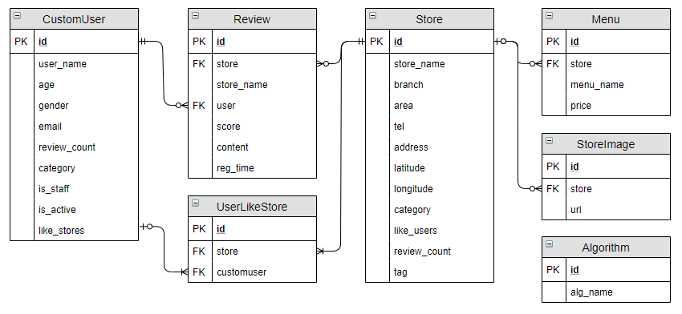

# 맛집 추천 서비스

서비스명은 맛집 추천 서비스를 제공하는 플랫폼입니다. knn, 협업필터링을 적용해서 사용자가 관심을 가질만 한 맛집을 추천해 주는 것을 목표로 삼고 있습니다.

## 핵심 기능 및 기대 효과

- 각종 알고리즘과 머신러닝을 기반으로 사용자에게 사용자의, 사용자를 위한, 사용자에 의한 맛집 추천 사이트
- 나만의 맛집 추천을 받고 싶은 사람들에게 맞춤 정장과 같은 느낌의 맛집 추천 시스템

## 주요 사용자

- 무분별한 맛집 추천에 지친 30대 차도남

## 개발 환경

### 사용 언어

- Python 3.6.8
- nodeJS 13.5.0

### 주요 라이브러리

- npm 6.13.4
- Django 2.2.7
- djangorestframework 3.10.3
- axios 0.19.0
- vue 2.6.10
- vuex 3.1.1
- pandas 0.25.3

그 외 기타 라이브러리는 backend/requirements.txt, frontend/package.json 참조

## How to Run

### front

```bash
cd frontend
npm install
npm runserve
```

### backend

윈도우

```bash
cd backend
pip install -r requirements.txt
python manage.py runserver
```

우분투

```bash
cd backend
pip3 install -r requirements.txt
python3 manage.py runserver
```

## data schema



## 파일/디렉터리 구조

### frontend

components

- 페이지 단위 컴포넌트에서 쓰이는 소규모 컴포넌트가 위치하는 디렉토리

views

- 페이지 단위의 컴포넌트가 위치하는 디렉토리

src > api

- http.js - 기본 url 관리, API요청시 헤더 관리 파일
- index.js - API 관리 파일

store > modules

- data.js - Vuex 관리 파일

router.js : 라우터 설정 관련 파일
store.js : vuex 파일
App.vue : 최상위 컴포넌트
main.js : 최상위 컴포넌트를 최초 호출하는 JavaScript 파일


## 명세

### req1 데이터 DB 마이그레이션

1. DB 모델 설계

   [data schema](#data schema) 참조

2. Pandas DataFrame DB 마이그레이션

   데이터를 DB에 넣으려면 아래와 같이 실행하면 된다.

   ```bash
   cd backend
   python manage.py initialize
   ## 우분투 환경에선 python 대신 python3을 입력하면 된다.
   ```

   initialize에 대한 설명

   ```python
   from pathlib import Path
   import pandas as pd
   from django.core.management.base import BaseCommand
   from backend import settings
   from api import models
   
   
   class Command(BaseCommand):
       help = "initialize database"
       DATA_DIR = Path(settings.BASE_DIR).parent / "data"
       DATA_FILE = str(DATA_DIR / "dump.pkl")
   
       def _load_dataframes(self):
           '''
           데이터프레임을 읽어옵니다.
           '''
           try:
               data = pd.read_pickle(Command.DATA_FILE)
           except:
               print(f"[-] Reading {Command.DATA_FILE} failed")
               exit(1)
           return data
   
       def _initialize(self):
           '''
           기존의 dataframe pkl파일을 읽어와서 DB에 저장합니다.
           '''
   
           print("[*] Loading data...")
           # dataframe pkl 파일을 읽어오는 _load_dataframes함수를 실행합니다.
           dataframes = self._load_dataframes()
   
           # 데이터 중 빈 값들을 0.0으로 입력해 줍니다.
           dataframes["stores"] = dataframes["stores"].fillna(0.0)
           dataframes["menues"]["price"]=dataframes["menues"]["price"].fillna(0.0).astype(int)
           
           print("[*] Delete all data...")
           # DB에 저장된 정보를 모두 지워 초기화해 줍니다.
           models.Store.objects.all().delete()
           models.CustomUser.objects.all().delete()
           models.Review.objects.all().delete()
           models.Menu.objects.all().delete()
           print("[+] Done")
   
           print("[*] Initializing stores...")
           # DB에 데이터를 작성합니다.
   
           stores = dataframes["stores"]
           # 데이터프레임에서 매장 정보를 가져옵니다.
   
           stores_bulk = [
               models.Store(
                   id=store.id,
                   store_name=store.store_name,
                   branch=store.branch,
                   area=store.area,
                   tel=store.tel,
                   address=store.address,
                   latitude=store.latitude,
                   longitude=store.longitude,
                   category=store.category,
                   # latitude와 longitude을 바탕으로 격자 값을 계산하여 location에 입력합니다.
                   # 맨 왼쪽 아래가 0번이고 맨 오른쪽 위가 가장 큰 값을 가지는 형태입니다.
                   location=int((store.latitude - 33.079772) / 0.0009) + (int((store.longitude -124.6)/0.0009)<<14) if store.longitude != 0.0 else 0,
                   # 매장에 작성된 리뷰 갯수를 입력합니다.
                   # 머신러닝에서 DB 데이터를 활용하기 위해 미리 계산해 칼럼에 입력합니다.
                   review_count=dataframes["reviews"]["store"][dataframes["reviews"]["store"]==store.id].count()
               )
               for store in stores.itertuples()
           ]
           # 벌크데이터 리스트를 만들고 모델에 입력합니다.
           models.Store.objects.bulk_create(stores_bulk)
           print("[+] Done")
   
           print("[*] Initializing users...")
           # store와 거의 동일.
           users = dataframes["users"]
           users_bulk = [
               models.CustomUser(
                   id=user.id,
                   username=user.id,
                   gender=user.gender,
                   age=user.age,
                   # 유저가 작성한 리뷰 갯수를 입력합니다.
                   # 머신러닝에서 DB 데이터를 활용하기 위해 미리 계산해 칼럼에 입력합니다.
                   review_count=dataframes["reviews"]["user"][dataframes["reviews"]["user"]==user.id].count()
               )
               for user in users.itertuples()
           ]
           models.CustomUser.objects.bulk_create(users_bulk)
           print("[+] Done")
   
           print("[*] Initializing menues...")
           menues = dataframes["menues"]
           menues_bulk = [
               models.Menu(
                   id=menu.id,
                   store_id=menu.store,
                   menu_name=menu.menu_name,
                   price=menu.price,
               )
               for menu in menues.itertuples()
           ]
           models.Menu.objects.bulk_create(menues_bulk)
           print("[+] Done")
   
           print("[*] Initializing reviews...")
           reviews = dataframes["reviews"]
           reviews_bulk = [
               models.Review(
                   store_id=review.store,
                   store_name=models.Store.objects.get(id=review.store).store_name,
                   user_id=review.user,
                   score=review.score,
                   content=review.content,
                   reg_time=review.reg_time,
               )
               for review in reviews.itertuples()
           ]
           models.Review.objects.bulk_create(reviews_bulk)
           print("[+] Done")
   
       def handle(self, *args, **kwargs):
           # python manage.py initialize를 실행하면 가장 먼저 들어오는 부분
           # _initialize함수를 실행한다.
           self._initialize()
   
   ```

   

### req2 웹 서비스 검색 기능 확장

1. 검색 기능 확장

   근처에 존재하는 매장들의 메뉴나 매장명을 검색하는 기능입니다.

   ```python
   @api_view(['POST'])
   def search_store(self):
       '''
       입력 데이터
       {
           "latitude": float,
           "longitude": float,
           "words": "string" 
       }
       '''
       # 위치 정보가 없으면 오류 반환
       if not self.data.get("longitude") or not self.data.get("latitude"):
           return Response("위치 정보가 없습니다.")
       
       # 입력받은 위치 정보를 격자 번호로 변환합니다.
       location_x = int((self.data["longitude"] -124.6)/0.0009)
       location_y = int((self.data["latitude"] - 33.079772) / 0.0009)
       
       # 현 위치와 인근 격자 번호를 계산합니다.
       location = location_y + (location_x<<14)
       location2 = location_y + ((location_x+1)<<14)
       location3 = location_y + ((location_x+2)<<14)
       location4 = location_y + ((location_x-1)<<14)
       location5 = location_y + ((location_x-2)<<14)
   
       location6 = location_y+1 + ((location_x-1)<<14)
       location7 = location_y+1 + ((location_x)<<14)
       location8 = location_y+1 + ((location_x+1)<<14)
   
       location9 = location_y+2 + ((location_x)<<14)
   
       location10 = location_y-1 + ((location_x-1)<<14)
       location11 = location_y-1 + ((location_x)<<14)
       location12 = location_y-1 + ((location_x+1)<<14)
   
       location13 = location_y-2 + ((location_x)<<14)
   
       # 인근에 존재하는 매장들을 모두 가져옵니다.
       queryset = Store.objects.filter(
           Q(location = location)
           |Q(location = location2)
           |Q(location = location3)
           |Q(location = location4)
           |Q(location = location5)
           |Q(location = location6)
           |Q(location = location7)
           |Q(location = location8)
           |Q(location = location9)
           |Q(location = location10)
           |Q(location = location11)
           |Q(location = location12)
           |Q(location = location13)
           )
   
       words = []
       # 검색어를 입력받아 띄워쓰기별로 나눠줍니다.
       if self.data.get("words"):
           words = self.data["words"].split()
       
       a = []
       if words:
           # 검색어가 존재할 경우 매장목록에 대해서 반복문을 돌면서
           # 검색 단어가 포함된 매장명이나 검색 단어가 포함된 메뉴가 있을 경우
           # a라는 리스트에 해당 매장을 추가합니다.
           for store in queryset:
               # print(store.location)
               chk = 0
               for word in words:
                   if store.store_name in word:
                       chk = 1
                       break
               if chk:
                   a.append(store)
                   continue
               for menu in store.menu_set.all():
                   for word in words:
                       if word in menu.menu_name:
                           chk = 1
                           break
                   if chk:
                       break
               if chk:
                   a.append(store)
           # 검색어에 해당하는 매장이 담긴 a 리스트를 직렬화합니다.
           serializer = serializers.StoreSerializer(a, many=True)
       else:
           serializer = serializers.StoreSerializer(queryset, many=True)
       # 데이터를 반환합니다.
       return Response(serializer.data)
   ```

   

2. 유저 정보 기능 구현

   유저의 상세 정보를 프론트에 제공해주기 위해 로그인 성공 시 유저 정보를 응답해줍니다.

   - views.py

   ```python
   class CustomLoginView(LoginView):
       def get_response(self):
           user = get_object_or_404(CustomUser, username=self.user)
           orginal_response = super().get_response()
           mydata = {"gender": user.gender, "age": user.age, "review_count": user.review_count, "status": "success"}
           orginal_response.data["user"].update(mydata)
           return orginal_response
   ```

   - urls.py

   ```python
       path('login/', views.CustomLoginView.as_view(), name='login'),
   ```

   - 추가사항: 회원탈퇴, 비밀번호 변경, 비밀번호 재설정 기능(REST API 참고)

3. 

   

4. 음식점 정보 기능 구현

   매장명에 해당하는 매장을 반환합니다.

   ```python
   class StoreDetailViewSet(viewsets.ModelViewSet):
       serializer_class = serializers.StoreDetailSerializer
       pagination_class = SmallPagination
   
       def get_queryset(self):
           name = self.request.query_params.get("name", "")
           queryset = (
               models.Store.objects.all().filter(store_name__contains=name).order_by("id")
           )
           return queryset
   ```

   

5. 음식점 사진 자료 크롤링

   크롤링을 시작하려면 아래와 같이 실행하면 된다.

   ```bash
   cd backend
   python manage.py crawling
   ## 우분투 환경에선 python 대신 python3을 입력하면 된다.
   ```

   네이버 검색 API를 이용하여 매장명, 주소를 검색한 후 해당 결과에서 나오는 img url을 수집하여 DB에 저장한다.

   

6. 네이버 검색 api를 활용해서 매장명, 주소를 검색하고 받아온 결과에서 이미지 url을 가져와 db에 입력합니다.

   ```python
   from api import models
   from django.core.management.base import BaseCommand
   import requests
   from bs4 import BeautifulSoup
   from api import models
   
   class Command(BaseCommand):
       def _initialize(self):
           search_base = "https://openapi.naver.com/v1/search/webkr.xml?query=다이닝코드+"
           search_opt = "&display=10&start=1"
           base = "https://www.diningcode.com/profile.php"
           headers={
                       "X-Naver-Client-Id": "HzusvK5FvwGA_OcXs0xZ",
                       "X-Naver-Client-Secret": "o7Hh0ooCxL",
                   }
           stores = models.Store.objects.all()
           for i in range(3691, len(stores)):
               store = stores[i]
               print(store.id)
               # print(store)
               # continue
               add = store.address
               store_name = store.store_name
               add = add.replace(' ', '+')
               store_name = store_name.replace(' ', '+')
               url = search_base+add+'+'+store_name+search_opt
               res = requests.get(url, headers=headers).text.split(base)
               # print(res)
               if len(res) >= 2:
                   q = res[1].split("</link>")[0]
                   print(q)
                   soup = BeautifulSoup(requests.get(base+q).text, 'html.parser')
                   a = soup.select('.btn-gallery-open > img')
                   print(a)
                   if a:
                       img = ''
                       img = a[0].attrs['src']
                       print(img)
                       models.StoreImage.objects.create(store=store, url=img)
       def handle(self, *args, **kwargs):
           self._initialize()
   
   ```

   

### req3 웹 서비스 인증 기능 구현

1. 회원가입 기능 구현

   라이브러리에서 제공하는 회원가입 기능을 커스터마이징하여 추가적인 정보를 받도록 하였습니다.

   - serializers.py

   ```python
   class CustomRegisterSerializer(RegisterSerializer):
       age = serializers.IntegerField(required=False)
       gender = serializers.CharField(max_length=2, required=False)
   
       def get_cleaned_data(self):
           data_dict = super().get_cleaned_data()
           data_dict['age'] = self.validated_data.get('age', '')
           data_dict['gender'] = self.validated_data.get('gender', '')
           return data_dict
   ```

   - adapter.py

   ```python
   from allauth.account.adapter import DefaultAccountAdapter
   
   
   class CustomAccountAdapter(DefaultAccountAdapter):
   
       def save_user(self, request, user, form, commit=False):
           user = super().save_user(request, user, form, commit)
           data = form.cleaned_data
           user.gender = data.get('gender')
           user.age = data.get('age')
           user.save()
           return user
   ```

   - urls.py

   ```python
   path('rest-auth/registration/', include('rest_auth.registration.urls')),
   ```

   - 추가사항: 이메일 인증(REST API 참고) 

     

2. 로그인, 로그아웃 기능 구현

   django-rest-auth, rest_framework_jwt라이브러리를 사용하였고, 로그인 했을 경우, JWT 토큰을 프론트에 넘겨줍니다.

   ```python
       path('login/', views.CustomLoginView.as_view(), name='login'),
   ```

   JWT토큰을 사용하였기 때문에 백엔드에서는 로그아웃에 대한 처리를 따로 하지않았습니다.

   - 추가사항: 회원탈퇴 기능
     - 완전히 유저를 삭제하지 않고 is_active 값을 조정해줌으로써 관련 댓글과 리뷰 정보는 남겨두도록 하였습니다.
     - views.UserViewSet

   ```python
    @api_view(['POST'])
       def user_delete(self):
           if self.user.is_authenticated == False:
               return Response("삭제 실패")
           else:
               user = get_object_or_404(CustomUser, username=self.user)
               user.is_active = False
               user.save()
               return Response("삭제 성공")
   ```


### req4 웹 서비스 리뷰 기능 구현

1. 리뷰 기능 구현

   ```python
   class StoreReviewSet(viewsets.ModelViewSet):
       serializer_class = serializers.ReviewSerializer
       pagination_class = SmallPagination
   
       def get_queryset(self):
           queryset = (
               models.Review.objects.all()
           )
           return queryset
   
       def create(self, request):
           # 리뷰를 작성하는 함수입니다.
           # if request.user.is_authenticated:
           #     data = request.data
           #     review = models.Review.objects.create(store_id=data["store"], user_id=request.user.id, content=data["content"], score=data["score"], reg_time=datetime.datetime.now())
           #     return Response("작성 성공")
           # else:
           #     return Response("작성 실패")
           data = request.data
           store = Store.objects.get(id=data["store"])
           store_name = store.store_name
           user = CustomUser.objects.get(id=data["user"])
   
           # 받아온 데이터를 이용해서 Review를 작성합니다.
           models.Review.objects.create(store_id=data["store"], user_id=data["user"], content=data["content"], score=data["score"], reg_time=datetime.datetime.now(), store_name=store_name)
           
           # 작성이 완료되었다면 매장과 유저의 review_count를 1씩 추가합니다.
           store.review_count += 1
           store.save()
           user.review_count += 1
           user.save()
           return Response("작성 성공")
   
       def update(self, request, pk=None):
           '''
           받아온 데이터에서 평점과 내용을 가져와 리뷰 객체를 수정합니다.
           '''
           review = models.Review.objects.get(id=pk)
           if request.data.get("score"):
               review.score = request.data["score"]
           if request.data.get("content"):
               review.content = request.data["content"]
           review.save()
           return Response("수정 성공")
   
       def destroy(self, request, pk=None):
           '''
           받아온 pk에 해당하는 리뷰를 삭제합니다.
           '''
           review = models.Review.objects.get(id=pk)
           user = models.CustomUser.objects.get(id=review.user_id)
           store = models.Store.objects.get(id=review.store_id)
           review.delete()
           user.review_count -= 1
           store.review_count -= 1
   
           return Response("삭제 성공")
   ```

   

### req5 KNN 알고리즘 구현

데이터 가공 -> 알고리즘 학습 -> user_based로 id에 대한 정보 선별 -> TOP10 식당 추천

1. 데이터 가공

   ```python
   # review가 10개 이상인 식당만 불러옴
   request_store = requests.get("http://i02d106.p.ssafy.io:8765/api/store/10").json()
   # review가 10개 이상인 유저만 불러옴
   request = requests.get("http://i02d106.p.ssafy.io:8765/api/user").json()
   request_all_review = requests.get("http://i02d106.p.ssafy.io:8765/api/reviews").json()
   qs1= pd.DataFrame(data=request_store)
   qs3= Review.objects.all()
   
   ten_review_store_list= []
   human_list = []
   for user in request:
       human_list.append(user['id'])
   print(len(request))
   for store in request_store:
       ten_review_store_list.append(store['id'])
   
   review_list = list(qs3.values())
   store_list = []
   for dic in review_list:
       if('score' in dic.keys() and 'user_id' in dic.keys() and 'store_id' in dic.keys()):
           if(dic['user_id'] in human_list and dic['store_id'] in ten_review_store_list):
               store_list.append(dic['store_id'])
   store_list = list(dict.fromkeys(store_list))
   print(len(store_list))
   # print(store_list[0])
   # print(store_list[1])
   
   #리스트로 바꾼 다음 데이터프레임으로 변환
   stores = qs1
   review = pd.DataFrame(list(qs3.values()))
   ratings = review[['user_id', 'store_id', 'score']]
   
   ```

2. KNN 알고리즘 학습 및 구현

   ```python
   # 안가본 식당
   def get_uneaten(ratings, store_list, user_id):
       eaten_store = ratings[ratings['user_id'] == user_id]['store_id'].tolist()
       uneaten_store = [store for store in store_list if store not in eaten_store]
       print('평점 매긴 식당 수 : ', len(eaten_store), '추천 대상 식당 수 : ', len(uneaten_store), '전체 식당 수 : ', len(store_list)  )
   
       return uneaten_store
   
   # 추천 식당 정렬해서 리턴
   def recomm_store(algo, user_id, unvisited_store, top_n=10):
       predicitons = []
       
       
       predicitons = [algo.predict(str(user_id), str(kk), r_ui=4, verbose=True) for kk in unvisited_store]
       pre1 = algo.predict(str(user_id), str(86))
       pre2 = algo.predict(str(user_id), str(149))
       print(123)
       print(pre1)
       print(pre2)
       # print(predicitons[0])
       # print(predicitons[1])
       def sortkey_est(pred):
           return pred.est
       
       predicitons.sort(key=sortkey_est, reverse=False)
   
       top_predictions = predicitons[:top_n]
   
       top_store_ids = [ int(pred.iid) for pred in top_predictions]
       top_store_rating = [pred.est for pred in top_predictions]
   
       top_sotre_preds = [ (id, rating) for id, rating in zip(top_store_ids, top_store_rating) ]
   
   
       return top_sotre_preds
   
   unvisited_store = get_uneaten(ratings, store_list, 235)
   
   top_store_preds = recomm_store(algo, 235, unvisited_store, top_n=10)
   print('#### Top 10 음식점####')
   for top_store in top_store_preds:
       print(top_store)
   ```

   

### req6 Matrix Factorization 알고리즘 구현

1. 데이터 가공

   ```python
   # review가 10개 이상인 식당만 불러옴
   request_store = requests.get("http://i02d106.p.ssafy.io:8765/api/store/10").json()
   # review가 10개 이상인 유저만 불러옴
   request = requests.get("http://i02d106.p.ssafy.io:8765/api/user").json()
   request_all_review = requests.get("http://i02d106.p.ssafy.io:8765/api/reviews").json()
   qs1= pd.DataFrame(data=request_store)
   qs3= Review.objects.all()
   
   ten_review_store_list= []
   human_list = []
   for user in request:
       human_list.append(user['id'])
   print(len(request))
   for store in request_store:
       ten_review_store_list.append(store['id'])
   
   review_list = list(qs3.values())
   store_list = []
   for dic in review_list:
       if('score' in dic.keys() and 'user_id' in dic.keys() and 'store_id' in dic.keys()):
           if(dic['user_id'] in human_list and dic['store_id'] in ten_review_store_list):
               store_list.append(dic['store_id'])
   store_list = list(dict.fromkeys(store_list))
   print(len(store_list))
   # print(store_list[0])
   # print(store_list[1])
   ```

## REST API

### get_store_reviews_by_store_id

경로: api/get_store_reviews_by_store_id/{store_id} 

메소드: GET

|   인자   | 필수 여부 |
| :------: | :-------: |
| store_id |   True    |


반환값

```json
[
  {
    "id": INT,
    "store": INT(store_id),
    "store_name": String(store_name),
    "user": INT(user_id),
    "score": INT(score),
    "content": String(content),
    "reg_time": Datetime(reg_time),
    "category_list": [
      String(category),
    ]
  }
]
```

### like_store

user_id와 store_id를 인자로 받아 해당하는 좋아요 객체가 있으면 그 객체를 지우고 없으면 객체를 생성합니다.

경로: api/like_store

메소드: POST

|     인자      | 필수 여부 |
| :-----------: | :-------: |
| store_id: INT |   True    |
| user_id: INT  |   True    |

반환값

좋아요 객체 생성 시

```json
"좋아요"
```

좋아요 객체 삭제 시

```json
"좋아요 취소"
```

### reviews

모든 리뷰의  store, user, score를 가져와 반환합니다.

경로: api/reviews

메소드: GET

반환값

```json
[
    {
        "store": INT(store_id),
        "user": INT(user_id),
        "score": INT(score)
    }
]
```

### search_store

위치 정보와 검색어를 받아와서 인근 매장 중 검색어가 포함된 매장을 반환합니다.

경로: api/search_store

메소드: POST

|       인자       | 필수 여부 |
| :--------------: | :-------: |
| latitude: Float  |   True    |
| longitude: Float |   True    |
|  words: String   |   False   |

반환값

```json
[
    {
        "id": INT(pk),
        "store_name": String(store_name),
        "branch": String(branch),
        "area": String(area),
        "tel": String(phone_number),
        "address": String(address),
        "latitude": Float(latitude),
        "longitude": Float(longitude),
        "category_list": [
            String(category)
        ],
        "review_count": INT(review_count),
        "menues": [          
            {
                "id": INT(menu_id),
                "store": INT(store_id),
                "menu_name": String(menu_name),
                "price": INT(price)
            },
        ]
	}
]
```

### store

입력받은 리뷰갯수 이상인 매장들의 id, review_count를 받아 옵니다.

경로: api/store/{review_count}

메소드: GET

|       인자        | 필수 여부 |
| :---------------: | :-------: |
| review_count: INT |   True    |

반환값

```json
[
    {
        "id": INT(store_id),
        "review_count": INT(review_count)
    }
]
```

### store_reviews

경로: api/store_reviews

메소드: GET

|      인자      | 필수 여부 |
| :------------: | :-------: |
|   page: INT    |   False   |
| page_size: INT |   False   |

반환값

```json
{
    "count": INT(number of stores),
    "next": String(url of next page),
    "previous": String(url of next page),
    "results": [
        {
            "id": INT(review_id),
            "store": INT(store_id),
            "store_name": String(store_name),
            "user": INT(user_id),
            "branch": String(branch),
            "area": String(area),
            "tel": String(phone_number),
            "address": String(address),
            "latitude": Float(latitude),
            "longitude": Float(longitude),
            "category_list": [
                String(category)
            ],
            "id": 1,
            "store": 15,
            "store_name": "써리힐",
            "user": 68632,
            "score": 5,
            "content": "전포 윗길에 새로 생긴! 호주에서 온 쉐프가 직접 요리하는 호주식 레스토랑!",
            "reg_time": "1970-01-01T00:00:00+09:00",
            "category_list": [
                "호주레스토랑"
            ]
        }
    ]
}
```

메소드: POST

인자를 입력하면 리뷰를 작성합니다.

|         인자         | 필수 여부 |
| :------------------: | :-------: |
| store: INT(store_id) |   True    |
|  user: INT(user_id)  |   True    |
|      score: INT      |   True    |
|   content: String    |   True    |

반환값

```json
"작성 성공"
```

메소드: PUT

인자를 입력하면 리뷰를 수정합니다.

|        인자        | 필수 여부 |
| :----------------: | :-------: |
| id: INT(review_id) |   True    |
|     score: INT     |   True    |
|  content: String   |   True    |

반환값

```json
"수정 성공"
```

메소드: DELETE

인자를 입력하면 리뷰를 삭제합니다.

|        인자        | 필수 여부 |
| :----------------: | :-------: |
| id: INT(review_id) |   True    |

반환값

```json
"삭제 성공"
```

### stores

경로: api/stores

메소드: GET

|      인자      | 필수 여부 |
| :------------: | :-------: |
|   page: INT    |   False   |
| page_size: INT |   False   |

반환값

```json
{
    "count": INT(number of stores),
    "next": String(url of next page),
    "previous": String(url of next page),
    "results": [
        {
            "id": INT(store_id),
            "store_name": String(store_name),
            "branch": String,
            "area": String,
            "tel": String(phone_number),
            "address": String(address),
            "latitude": Float(latitude),
            "longitude": Float(longitude),
            "category_list": [
                String(category)
            ],
            "review_count": INT,
        }
    ]
}
```

### user_reviews

경로: api/user_reviews

메소드: GET

|      인자      | 필수 여부 |
| :------------: | :-------: |
|   page: INT    |   False   |
| page_size: INT |   False   |

반환값

```json
{
    "count": INT(number of users),
    "next": String(url of next page),
    "previous": String(url of next page),
    "results": [
        {
            "id": INT(review_id),
            "store": INT(store_id),
            "store_name": String(store_name),
            "user": INT(user_id),
            "score": INT(user_id),
            "content": String,
            "reg_time": Datetime,
            "category_list": [
                String(category)
            ],
        }
    ]
}
```

### algorithm_change

현재 서버에서 협업필터링 기반 추천 시스템에 적용할 알고리즘을 선택하는 부분입니다.

0번의 경우 svdpp, 1번의 경우 knn알고리즘을 적용하여 맛집을 추천해 줍니다.

경로: api/algorithm_change

메소드: PUT

|      인자      | 필수 여부 |
| :------------: | :-------: |
| algorithm: INT |   True    |

반환값: 지금부터 적용될 알고리즘 이름 String

### algorithm_check

현재 서버에서 협업필터링 기반 추천 시스템에 적용되어 있는 알고리즘을 확인하는 api입니다.

경로: api/algorithm_check

메소드: GET

반환값: 현재 적용중인 알고리즘 이름 String

### update_learning_dataframe

현재 서버에서 협업필터링 기반 추천 시스템을 학습시키기 위한 데이터프레임을 갱신하는 api입니다.

경로: api/update_learning_dataframe

메소드: GET

반환값: "갱신 완료"

### relearning_current_model

현재 서버에서 적용된 협업필터링 기반 추천 알고리즘을 재학습시키는 